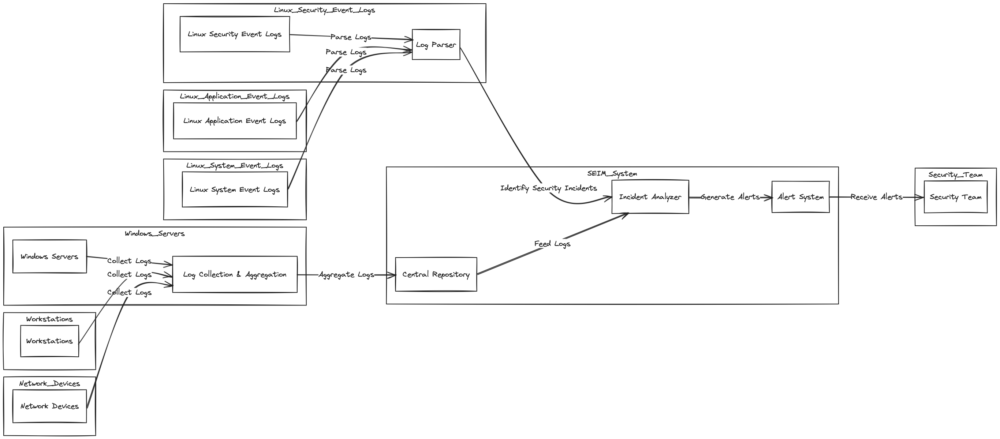

## Table of Contents

1. [Introduction](#introduction)
   - [Introduction](#introduction-1)
   - [Purpose](#purpose)
   - [Document Conventions](#document-conventions)
   - [Intended Audience](#intended-audience)
   - [Product Scope](#product-scope)
2. [Literature Survey](#literature-survey)
   - [Research Paper 1](#research-paper-1)
   - [Research Paper 2](#research-paper-2)
   - [Research Paper 3](#research-paper-3)
   - [Research Paper 4](#research-paper-4)
   - [Research Paper 5](#research-paper-5)
   - [Research Paper 6](#research-paper-6)
   - [Research Paper 7](#research-paper-7)
   - [Research Paper 8](#research-paper-8)
   - [Research Paper 9](#research-paper-9)
   - [Research Paper 10](#research-paper-10)
3. [Software Requirements Specification (SRS)](#software-requirements-specification-srs)
   - [Overall Description](#overall-description)
   - [Product Functions](#product-functions)
   - [User Classes and Characteristics](#user-classes-and-characteristics)
   - [Operating Environment](#operating-environment)
   - [Assumptions and Dependencies](#assumptions-and-dependencies)
4. [System Design](#system-design)
   - [External Interface](#external-interface)
     - [User Interfaces](#user-interfaces)
     - [Hardware Interfaces](#hardware-interfaces)
     - [Software Interfaces](#software-interfaces)
     - [Communication Interfaces](#communication-interfaces)
   - [System Features](#system-features)
     - [Kernel Space Logging](#kernel-space-logging)
     - [OCSF Standardization](#ocsf-standardization)
     - [Automated Threat Detection](#automated-threat-detection)
5. [Methodology](#methodology)
   - [Data Acquisition Phase](#data-acquisition-phase)
   - [Data Processing Phase](#data-processing-phase)
   - [Threat Detection and Response Phase](#threat-detection-and-response-phase)
6. [Implementation](#implementation)
   - [Phase 1: Advanced Logging](#phase-1-advanced-logging)
   - [Phase 2: Log Standardization and Analysis](#phase-2-log-standardization-and-analysis)
   - [Phase 3: AI Log Processing](#phase-3-ai-log-processing)
   - [Phase 4: Automated Threat Detection](#phase-4-automated-threat-detection)
   - [Phase 5: Monitoring and Response](#phase-5-monitoring-and-response)
   - [Phase 6: Continuous Improvement](#phase-6-continuous-improvement)
7. [Conclusion](#conclusion)
8. [Future Work](#future-work)
   - [Expand platform support](#expand-platform-support)
   - [Integrate with more data sources](#integrate-with-more-data-sources)
   - [Improve AI/ML capabilities](#improve-aiml-capabilities)
   - [Compliance frameworks](#compliance-frameworks)
   - [Cloud-native options](#cloud-native-options)
   - [Cyber deception](#cyber-deception)
   - [Incident response workflows](#incident-response-workflows)
   - [User experience refinements](#user-experience-refinements)
   - [Baseline modeling](#baseline-modeling)
   - [Data lakes](#data-lakes)

## Introduction

### Introduction

In today's digital world, cybersecurity threats are increasing rapidly. Organizations face major risks from cyber attacks that can cause serious damage. To protect against these threats, new and better cybersecurity solutions are desperately needed. OpenArmor is an innovative solution that uses advanced techniques to detect threats early and improve monitoring capabilities.

### Purpose

This project report document explains the main goals and scope of OpenArmor, a cutting-edge cybersecurity solution. It describes in detail OpenArmor's advanced logging system, how it uses artificial intelligence (AI), and how it alerts users to threats proactively. This document serves as a complete guide for developing and setting up OpenArmor, ensuring everyone understands what it does and how it works.

### Document Conventions

To ensure clarity and consistency throughout this project report, simple and well-defined writing practices have been followed. The priority or importance of each requirement is clearly stated using easy-to-understand terminology. This straightforward approach allows all stakeholders, regardless of their technical background, to comprehend the requirements fully and without ambiguity. By explicitly highlighting the criticality of various specifications, this document facilitates effective communication and collaboration among all parties involved in the development and implementation of OpenArmor.

### Intended Audience

This document is meant for a range of users including developers, cybersecurity experts, project managers, and system administrators. It gives an overview of OpenArmor's functions in an organized way. This allows readers to understand the key components and how they work together. For best understanding, readers should start with the overview sections first before reading the detailed requirements relevant to their role.

### Product Scope

OpenArmor is an advanced cybersecurity solution built to strengthen defenses against growing cyber threats. By using eBPF logging technology and AI algorithms, it provides full visibility into system activity. This allows it to detect threats early and respond rapidly. OpenArmor aligns with organizations' goals of improving cybersecurity, reducing risks, and protecting critical systems/data.

With its advanced logging and intelligent threat analysis, OpenArmor enables organizations to stay one step ahead of emerging threats. It minimizes the impact of potential breaches and ensures operations can continue smoothly. By providing clear alerts and insights, OpenArmor equips security teams to respond swiftly to threats, ultimately reducing overall risk exposure.

## Literature Survey

### Research Paper 1

**Title**: A Framework for eBPF-Based Network Functions in an Era of Microservices  
**Author**: Miano, S., Risso, F., Bernal, M. V., Bertrone, M., and Lu, Y. (2021). A framework for eBPF-based network functions in an era of microservices. IEEE Transactions on Network and Service Management, 18(1), 133-151.  
**Summary**: The paper proposes a framework that leverages eBPF (extended Berkeley Packet Filter) technology to develop and deploy network functions as eBPF programs in microservices environments. The framework consists of components for eBPF program development, deployment, and communication, enabling efficient and scalable implementation of network functions like load balancers and firewalls. Evaluation results demonstrate the framework's ability to achieve high throughput and low latency, comparable or better than traditional kernel-bypass solutions, while offering improved flexibility and agility in provisioning network functions.

### Research Paper 2

**Title**: A Framework for Document-level Cybersecurity Event Extraction from Open Source Data  
**Author**: Luo, N., Du, X., He, Y., Jiang, J., Wang, X., Jiang, Z., and Zhang, K. (2021, May). A framework for document-level cybersecurity event extraction from open source data. In 2021 IEEE 24th International Conference on Computer Supported Cooperative Work in Design (CSCWD) (pp. 422-427). IEEE.  
**Summary**: The paper presents a framework for extracting cybersecurity events from opensource data at the document level. It proposes a deep learning model that performs joint entity recognition and event extraction, capturing both intra- and inter-sentence dependencies. The framework leverages external knowledge bases to enrich the extracted events with contextual information. Experimental results on real-world datasets demonstrate the framework's effectiveness in accurately identifying and characterizing cybersecurity incidents from unstructured text data.

### Research Paper 3

**Title**: Distributed cloud monitoring using Docker as next generation container virtualization technology  
**Author**: Dhakate, S., and Godbole, A. (2015, December). Distributed cloud monitoring using Docker as next generation container virtualization technology. In 2015 Annual IEEE India Conference (INDICON) (pp. 1-5). IEEE.  
**Summary**: This paper proposes a distributed cloud monitoring system that leverages Docker, a next-generation container virtualization technology. The system employs Docker containers to encapsulate monitoring agents, enabling efficient deployment and management of monitoring components across distributed cloud environments. The authors demonstrate the system's ability to monitor cloud resources effectively while minimizing overhead and providing scalability benefits compared to traditional virtualization approaches.

### Research Paper 4

**Title**: AI-Driven Cybersecurity: An Overview, Security Intelligence Modeling and Research Directions  
**Author**: Sarker, I. H., Furhad, M. H., and Nowrozy, R. (2021). Ai-driven cybersecurity: an overview, security intelligence modeling and research directions. SN Computer Science, 2(3), 173.  
**Summary**: This paper provides an overview of leveraging artificial intelligence (AI) for cybersecurity. It explores various AI and machine learning techniques like deep learning, reinforcement learning, and ensemble methods that can be applied to domains such as network security, malware detection, and intrusion prevention. The authors highlight the benefits of AI-driven security solutions, including adaptability, scalability, and proactive threat detection capabilities. The paper also outlines research challenges and future directions for developing robust AI-based cybersecurity systems, such as handling adversarial attacks, dealing with data scarcity, and ensuring model transparency and interpretability.

### Research Paper 5

**Title**: Unpacking strategic behavior in cyberspace: a schema-driven approach  
**Author**: Gomez, M. A., and Whyte, C. (2022). Unpacking strategic behavior in cyberspace: a schema-driven approach. Journal of Cybersecurity, 8(1), tyac005.  
**Summary**: This paper proposes a schema-driven approach to analyze and understand strategic behavior in cyberspace. It introduces a framework that combines cognitive schemas and game theory to model the decision-making processes and interactions between adversaries in cyber conflicts. The authors argue that this approach can provide insights into the motivations, goals, and potential actions of cyber threat actors, enabling more effective cybersecurity strategies and deterrence mechanisms. The framework is illustrated through case studies, demonstrating its applicability in unpacking the complexities of strategic cyber behavior.

### Research Paper 6

**Title**: Developing a UI and Automation Framework for a Cybersecurity Research and Experimentation Environment  
**Author**: Butler, C., Thompson, G., Hsieh, G., Hoppa, M. A., and Nauer, K. S. (2018). Developing a UI and Automation Framework for a Cybersecurity Research and Experimentation Environment. In Proceedings of the International Conference on Security and Management (SAM) (pp. 208-213). The Steering Committee of The World Congress in Computer Science, Computer Engineering and Applied Computing (WorldComp).  
**Summary**: The paper describes the development of a user interface (UI) and automation framework for a cybersecurity research and experimentation environment. The framework aims to simplify the process of configuring and deploying cybersecurity Here is the continued document in MDX format:

### Research Paper 7

**Title**: Extracting rich semantic information about cybersecurity events  
**Author**: Satyapanich, T., Finin, T., and Ferraro, F. (2019, December). Extracting rich semantic information about cybersecurity events. In 2019 IEEE International Conference on Big Data (Big Data) (pp. 5034-5042). IEEE.  
**Summary**: This paper presents an approach for extracting rich semantic information about cybersecurity events from unstructured text data sources. The authors propose a hybrid system that combines machine learning techniques with knowledge-based methods to identify and characterize cybersecurity incidents. Their system utilizes named entity recognition, relation extraction, and event detection models to extract relevant entities, relationships, and event details from text. The extracted information is then represented using semantic web technologies, enabling complex querying and reasoning over cybersecurity event data. Evaluation on real-world datasets demonstrates the system's effectiveness in accurately capturing comprehensive details about cybersecurity incidents from textual reports.

### Research Paper 8

**Title**: An autonomous cybersecurity framework for next-generation digital service chains  
**Author**: Repetto, M., Striccoli, D., Piro, G., Carrega, A., Boggia, G., and Bolla, R. (2021). An autonomous cybersecurity framework for next-generation digital service chains. Journal of Network and Systems Management, 29(4), 37.  
**Summary**: This paper proposes an autonomous cybersecurity framework for securing next-generation digital service chains in 5G and beyond networks. The framework employs machine learning techniques and software-defined networking principles to dynamically deploy and orchestrate virtual security functions based on detected threats and service requirements. It enables proactive and adaptive security management, automating the provisioning of security services while optimizing resource utilization. The authors evaluate the framework's performance, demonstrating its ability to provide effective and efficient cybersecurity protection for complex service chains.

### Research Paper 9

**Title**: Integrating Cybersecurity Into a Big Data Ecosystem  
**Author**: Tall, A. M., Zou, C. C., and Wang, J. (2021, November). Integrating Cybersecurity Into a Big Data Ecosystem. In MILCOM 2021-2021 IEEE Military Communications Conference (MILCOM) (pp. 69-76). IEEE.  
**Summary**: This paper presents an approach to integrate cybersecurity capabilities into a big data ecosystem. The authors propose a framework that leverages big data technologies and machine learning techniques to process and analyze large volumes of security data from various sources. The framework aims to provide real-time threat detection, risk assessment, and incident response capabilities within a unified big data platform, enabling efficient and scalable cybersecurity operations.

### Research Paper 10

**Title**: Web of cybersecurity: Linking, locating, and discovering structured cybersecurity information  
**Author**: Takahashi, T., Panta, B., Kadobayashi, Y., and Nakao, K. (2018). Web of cybersecurity: Linking, locating, and discovering structured cybersecurity information. International Journal of Communication Systems, 31(3), e3470.  
**Summary**: The paper introduces the concept of a "Web of Cybersecurity," a decentralized network for sharing and discovering structured cybersecurity information. The authors propose a linked data approach, where cybersecurity data is represented using semantic web technologies and interconnected through links. This enables efficient discovery, integration, and analysis of cybersecurity information from diverse sources. The paper outlines techniques for linking, locating, and querying cybersecurity data within this web-based ecosystem.

## Software Requirements Specification (SRS)

### Overall Description

OpenArmor stands as a pivotal component within the cybersecurity landscape, offering advanced logging capabilities coupled with AI-driven threat detection mechanisms. While it operates as a standalone product, it seamlessly integrates with existing cybersecurity frameworks, enhancing overall defense strategies. A simple diagram illustrating system components and external interfaces aids in conceptualizing OpenArmor's role within the larger ecosystem.

### Product Functions

- eBPF Logging: Efficient capture of kernel-level system logs with minimal overhead.
- OCSF Standardization: Structuring and normalization of logs into standardized formats for interoperability.
- Kernel Space Logging: Extraction of logs directly from the kernel space, providing lower-level visibility.
- AI Log Processing: Parsing, analyzing, and transforming logs into standardized formats using artificial intelligence algorithms.
- Automated Threat Detection: Utilization of machine learning to baseline normal behavior and identify anomalies indicative of cyber threats.

### User Classes and Characteristics

User classes include cybersecurity analysts, system administrators, and IT professionals. Each class possesses varying levels of technical expertise and operational requirements. The software caters to these diverse user profiles, offering tailored functionalities to meet their specific needs.

### Operating Environment

OpenArmor operates within diverse operating environments, spanning different hardware platforms and operating systems. It seamlessly integrates with existing software components and applications, ensuring compatibility and interoperability across diverse infrastructures.

### Assumptions and Dependencies

Assumptions regarding third-party components, development environments, and external dependencies are crucial considerations for the successful implementation of OpenArmor. Clear identification and documentation of these factors mitigate risks associated with unforeseen challenges or changes in project dynamics.

## System Design

### External Interface

#### User Interfaces

The user interface of OpenArmor encompasses intuitive interactions between the software product and its users. Key characteristics include:

- Graphical User Interface (GUI) standards adhering to modern design principles.
- Screen layout constraints ensuring optimal user experience.
- Standard buttons and functions such as help options available consistently across screens.
- Error message display standards for clear communication of system issues.
- Detailed user interface design documented separately in the User Interface Specification.

#### Hardware Interfaces

OpenArmor interacts with hardware components of the system through logical and physical interfaces, including:

- Supported device types compatible with OpenArmor's operations.
- Nature of data and control interactions between the software and hardware components.
- Communication protocols utilized for seamless integration with hardware.

#### Software Interfaces

Interconnections between OpenArmor and other software components are crucial for seamless functionality, including:

- Integration with specific software components (name and version) for data exchange.
- Identification of data items/messages entering and exiting the system.
- Description of services needed and the nature of communications.
- Detailed documentation referencing application programming interface protocols.

#### Communication Interfaces

Communication requirements associated with OpenArmor include:

- Support for various communication functions such as email, web browsing, and network server communications protocols.
- Definition of pertinent message formatting standards.
- Identification of communication standards such as FTP or HTTP.
- Specification of communication security and encryption protocols, data transfer rates, and synchronization mechanisms.

### System Features

#### Kernel Space Logging

**Description and Priority**  
Efficient extraction of logs directly from the kernel space with minimal overhead.

**Stimulus/Response Sequences**

- User initiates logging process.
- OpenArmor captures kernel-level system logs.
- System responds with captured log data.

**Functional Requirements**

- REQ-1: Implement eBPF technology to capture kernel-level system logs.
- REQ-2: Ensure minimal overhead during the logging process.

#### OCSF Standardization

**Description and Priority**  
Structured normalization of logs into standardized formats for interoperability.

**Stimulus/Response Sequences**

- User triggers log normalization process.
- OpenArmor transforms raw logs into standardized OCSF format.
- System confirms successful normalization.

**Functional Requirements**

- REQ-3: Implement algorithms for structuring and normalizing logs into OCSF format.
- REQ-4: Ensure interoperability with external systems.

#### Automated Threat Detection

**Description and Priority**  
Utilization of machine learning for proactive threat detection.

**Stimulus/Response Sequences**

- OpenArmor continuously analyzes log data for anomalies.
- Detected anomalies trigger threat alerts.
- System provides recommendations for threat mitigation.

**Functional Requirements**

- REQ-5: Develop machine learning algorithms to baseline normal behavior.
- REQ-6: Implement anomaly detection mechanisms for proactive threat identification.

## Methodology

To develop OpenArmor, an advanced cybersecurity solution leveraging AI and advanced logging, we followed a systematic approach combining cutting-edge technologies and industry best practices. The methodology can be divided into three main phases: data acquisition, data processing, and threat detection and response.

### Data Acquisition Phase

In this phase, we employed eBPF (Extended Berkeley Packet Filter) for efficient kernel-level logging and monitoring of system activities. eBPF provides a safe and efficient way to run sandboxed programs in the Linux kernel, allowing us to gain complete visibility into system activities without the overhead of traditional monitoring methods.

### Data Processing Phase

The raw log data collected through eBPF was structured and enriched using the OCSF (Ordered Cloud Security Format) standard. OCSF is a standardized format for representing security events, enabling better analysis and interoperability with other security tools. This phase involved parsing and enriching the log data with relevant contextual information, such as timestamps, source and destination IP addresses, and event types.

### Threat Detection and Response Phase

This phase leveraged artificial intelligence and machine learning techniques to establish a baseline of normal system behavior and automatically detect anomalies or potential threats. We employed unsupervised learning algorithms, such as clustering and outlier detection, to identify patterns and deviations from the established baseline.

Once potential threats were detected, OpenArmor's AI-driven system triggered automated alerts and provided actionable insights for rapid investigation and response. The system continuously monitored for new threats, enabling proactive cybersecurity measures rather than reactive defense.

Throughout the development process, we adhered to industry best practices and rigorous testing methodologies to ensure the accuracy, reliability, and scalability of OpenArmor. The solution was designed to provide enterprise-grade protection through continuous monitoring, automated analysis, and timely alerts, ultimately reducing the overall risk profile and hardening cyber defenses.

## Implementation

The implementation of the advanced logging and analysis system follows a phased approach. Phase 1 focuses on deploying eBPF logging, kernel space logging, and structured logging frameworks to capture comprehensive system events and activities. Phase 2 involves standardizing logs using OCSF, implementing AI log processing models for analysis, and developing threat detection rules. Phase 3 will mainly focus on the Log processing through the means of Artificial Intelligence(AI). In Phase 4, the obtained log data will be processed and analyzed for the automation of threat detection process. Phase 5 integrates the analysis results with monitoring systems for incident response, while Phase 6 emphasizes continuous improvement through feedback loops, model updates, and threat intelligence integration. Each phase employs cutting-edge techniques like machine learning, natural language processing, and automated correlation to ensure robust security posture and proactive threat detection.

### Phase 1: Advanced Logging

- eBPF Logging: Utilize eBPF (Extended Berkeley Packet Filter) to capture low-level system events and kernel activities with minimal overhead. eBPF allows you to safely run sandboxed programs in the kernel space, enabling efficient logging of system calls, network events, and other kernel-level activities.
- Kernel Space Logging: Implement kernel modules or leverage existing kernel instrumentation frameworks (e.g., ftrace, perf, or LTTng) to capture kernel-level events directly from the operating system kernel. This enables logging of events such as process creation, file access, network traffic, and system resource utilization.
- Structured Logging: Adopt structured logging formats like JSON or Protocol Buffers to ensure consistent and machine-readable log data across applications and services. Structured logging allows for easier parsing, indexing, and analysis of log data.

### Phase 2: Log Standardization and Analysis

- OCSF Standardization: Implement the Open Cybersecurity Schema Framework (OCSF) or similar industry standards to normalize log data from various sources into a consistent format. This standardization process typically involves parsing, enriching, and mapping log data to a common schema, enabling seamless integration and analysis across different systems.
- AI Log Processing: Train and deploy machine learning models, such as natural language processing (NLP) models or deep learning architectures, to analyze log data and extract valuable insights. These models can be used for tasks like log classification, anomaly detection, and root cause analysis.
- Threat Detection Rules: Develop and maintain a library of threat detection rules based on known attack patterns, security vulnerabilities, and industry best practices. These rules can be based on signatures, heuristics, or machine learning models, and can be applied to the standardized log data to identify potential security threats or policy violations.
- Automated Correlation: Implement automated log correlation techniques to connect and analyze related events across different log sources. This can help identify complex attack patterns, track user activities, and provide a comprehensive view of security incidents.

### Phase 3: AI Log Processing

- Employ natural language processing (NLP) techniques to extract relevant information from unstructured log data, such as error messages, stack traces, and free-text descriptions.
- Use unsupervised machine learning algorithms like clustering and anomaly detection to identify unusual patterns or deviations from normal behavior in log data.
- Implement sequence learning models, such as recurrent neural networks (RNNs) or transformer architectures, to analyze log sequences and detect anomalies based on temporal patterns.
- Develop supervised machine learning models, like decision trees or neural networks, to classify log events based on labeled training data from known incidents or threats.

### Phase 4: Automated Threat Detection

- Implement rule-based threat detection engines that leverage predefined signatures or patterns to identify known threats, such as malware infections, unauthorized access attempts, or policy violations.
- Develop statistical anomaly detection models that can identify deviations from expected behavior or baseline patterns, indicating potential threats or compromised systems.
- Utilize graph-based analysis techniques to identify suspicious relationships or interactions between entities (e.g., users, processes, network connections) in log data.
- Implement user and entity behavior analytics (UEBA) models that can detect insider threats, compromised accounts, or policy violations by analyzing user activities and behavioral patterns.
- Integrate threat intelligence feeds and indicators of compromise (IoCs) from external sources to enhance threat detection capabilities and identify emerging threats.
- Continuously retrain and update machine learning models with new log data and labeled incidents to improve accuracy and adapt to evolving threats.

### Phase 5: Monitoring and Response

- Set up a centralized logging and analysis platform to collect, store, and process logs from multiple sources in real-time.
- Integrate the analysis results with security information and event management (SIEM) systems for comprehensive monitoring and incident response.
- Define incident response procedures and workflows to investigate and mitigate detected threats based on the automated threat detection alerts.

### Phase 6: Continuous Improvement

- Establish a feedback loop to continuously refine and improve the logging, analysis, and threat detection processes based on real-world incidents and evolving security threats.
- Regularly update and enhance the AI log processing models, threat detection rules, and logging mechanisms to adapt to new attack vectors and techniques.
- Leverage machine learning and data analytics to identify emerging patterns and trends in log data, enabling proactive security measures and threat intelligence gathering.

## Conclusion

Advanced logging solutions offer a potent arsenal of cybersecurity capabilities, empowering organizations with heightened threat visibility, accelerated investigation processes, and proactive threat detection fueled by cutting-edge technologies like eBPF, AI, and log standardization. However, these formidable tools are not without their limitations. The sheer volume of data generated, potential performance impacts, intricate setup procedures, the ever-present risk of false positives, and the introduction of an expanded attack surface demand careful consideration and meticulous evaluation.

When judiciously architected, meticulously configured, and adroitly managed, these advanced logging mechanisms can unleash a torrent of contextual intelligence and real-time monitoring prowess, fortifying cyber defenses with invaluable insights. Nonetheless, the inherent complexity of such systems necessitates a wealth of expertise and substantial resources to optimize their benefits while mitigating potential pitfalls.

In the grand scheme, when implemented with due diligence and expert oversight, advanced logging emerges as an indispensable security asset for organizations seeking to bolster their cyber threat detection capabilities through smarter, more intelligent methods. However, this formidable advantage is tempered by notable implementation challenges that demand unwavering attention and strategic mitigation to ensure a seamless integration and maximum return on investment.

## Future Work

Future work on OpenArmor will concentrate on broadening its compatibility across different platforms like Windows and cloud services. Integrating more data sources and enhancing the AI/ML models for better threat detection is also vital. Additionally, exploring areas such as containerization, deception tactics, and refined behavioral baselining can bolster OpenArmor's intelligent security capabilities. Improving incident response integration and user-friendliness will ensure OpenArmor stays a top-notch, easy-to-use cybersecurity solution.

### Expand platform support

Going forward, enabling advanced logging capabilities across a wider range of platforms beyond Linux, such as Windows, macOS, virtualization platforms, cloud environments, and container orchestrators, would greatly enhance OpenArmor's versatility and adoption across diverse enterprise environments.

### Integrate with more data sources

Incorporating additional contextual data sources like network traffic, endpoint logs, access logs, DNS logs, etc., could further enrich OpenArmor's analytics capabilities, providing a more comprehensive view of potential threats and enabling more accurate detection models.

### Improve AI/ML capabilities

Continuous research and development in enhancing the machine learning algorithms for behavioral analytics would be crucial for reducing Here is the continued document in MDX format:

### Improve AI/ML capabilities

Continuous research and development in enhancing the machine learning algorithms for behavioral analytics would be crucial for reducing false positives, improving threat detection accuracy, and enabling automated threat hunting capabilities, keeping OpenArmor at the forefront of intelligent cybersecurity solutions.

### Compliance frameworks

Building additional integrations and dashboards tailored to common compliance frameworks like PCI DSS, HIPAA, SOX, etc., would simplify auditing processes and ensure OpenArmor's alignment with industry-specific regulatory requirements, further solidifying its value proposition.

### Cloud-native options

Developing cloud-native implementations of OpenArmor, leveraging serverless architectures, containers, and Kubernetes, would increase deployment flexibility and enable seamless integration with modern cloud computing environments, facilitating adoption in cloud-centric organizations.

### Cyber deception

Incorporating cyber deception techniques, such as honeypots, could provide valuable insights for further validating and tuning OpenArmor's behavioral models, enhancing its ability to detect and respond to advanced persistent threats.

### Incident response workflows

Streamlining integration with Security Orchestration, Automation, and Response (SOAR) platforms, ticketing systems, and threat intelligence feeds would accelerate incident response processes, enabling security teams to respond more efficiently to identified threats.

### User experience refinements

Continuously enhancing the user interface and user experience aspects of OpenArmor, with a focus on simplified triage of security alerts and actionable analytics, would improve usability and increase the efficiency of security analysts interacting with the platform.

### Baseline modeling

Ongoing research and refinement of algorithms for developing precise normal behavioral baselines across different types of systems and applications would be essential for improving the accuracy and effectiveness of OpenArmor's anomaly detection capabilities.

### Data lakes

Architecting efficient solutions for storing and querying massive volumes of log data in data lakes would enable deeper historical analysis, facilitating advanced threat hunting and forensic investigations within OpenArmor's analytical framework.
