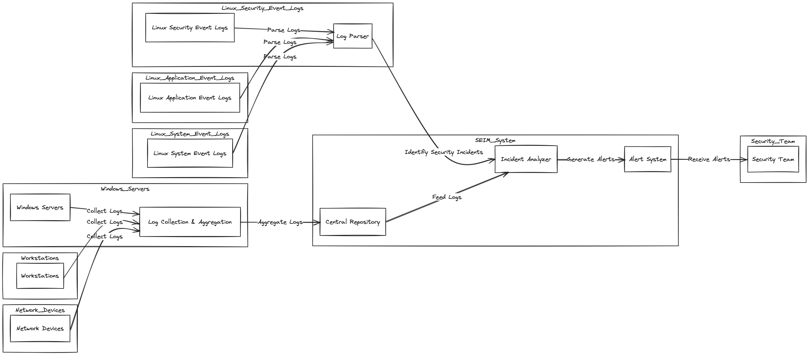

[System Design](#system-design)

- [External Interface](#external-interface)
  - [User Interfaces](#user-interfaces)
  - [Hardware Interfaces](#hardware-interfaces)
  - [Software Interfaces](#software-interfaces)
  - [Communication Interfaces](#communication-interfaces)
- [System Features](#system-features)
  - [Kernel Space Logging](#kernel-space-logging)
  - [OCSF Standardization](#ocsf-standardization)
  - [Automated Threat Detection](#automated-threat-detection)

## System Design

### External Interface

#### User Interfaces

The user interface of OpenArmor encompasses intuitive interactions between the software product and its users. Key characteristics include:

- Graphical User Interface (GUI) standards adhering to modern design principles.
- Screen layout constraints ensuring optimal user experience.
- Standard buttons and functions such as help options available consistently across screens.
- Error message display standards for clear communication of system issues.
- Detailed user interface design documented separately in the User Interface Specification.

#### Hardware Interfaces

OpenArmor interacts with hardware components of the system through logical and physical interfaces, including:

- Supported device types compatible with OpenArmor's operations.
- Nature of data and control interactions between the software and hardware components.
- Communication protocols utilized for seamless integration with hardware.

#### Software Interfaces

Interconnections between OpenArmor and other software components are crucial for seamless functionality, including:

- Integration with specific software components (name and version) for data exchange.
- Identification of data items/messages entering and exiting the system.
- Description of services needed and the nature of communications.
- Detailed documentation referencing application programming interface protocols.

#### Communication Interfaces

Communication requirements associated with OpenArmor include:

- Support for various communication functions such as email, web browsing, and network server communications protocols.
- Definition of pertinent message formatting standards.
- Identification of communication standards such as FTP or HTTP.
- Specification of communication security and encryption protocols, data transfer rates, and synchronization mechanisms.

### System Features

#### Kernel Space Logging

**Description and Priority**  
Efficient extraction of logs directly from the kernel space with minimal overhead.

**Stimulus/Response Sequences**

- User initiates logging process.
- OpenArmor captures kernel-level system logs.
- System responds with captured log data.

**Functional Requirements**

- REQ-1: Implement eBPF technology to capture kernel-level system logs.
- REQ-2: Ensure minimal overhead during the logging process.

#### OCSF Standardization

**Description and Priority**  
Structured normalization of logs into standardized formats for interoperability.

**Stimulus/Response Sequences**

- User triggers log normalization process.
- OpenArmor transforms raw logs into standardized OCSF format.
- System confirms successful normalization.

**Functional Requirements**

- REQ-3: Implement algorithms for structuring and normalizing logs into OCSF format.
- REQ-4: Ensure interoperability with external systems.

#### Automated Threat Detection

**Description and Priority**  
Utilization of machine learning for proactive threat detection.

**Stimulus/Response Sequences**

- OpenArmor continuously analyzes log data for anomalies.
- Detected anomalies trigger threat alerts.
- System provides recommendations for threat mitigation.

**Functional Requirements**

- REQ-5: Develop machine learning algorithms to baseline normal behavior.
- REQ-6: Implement anomaly detection mechanisms for proactive threat identification.

